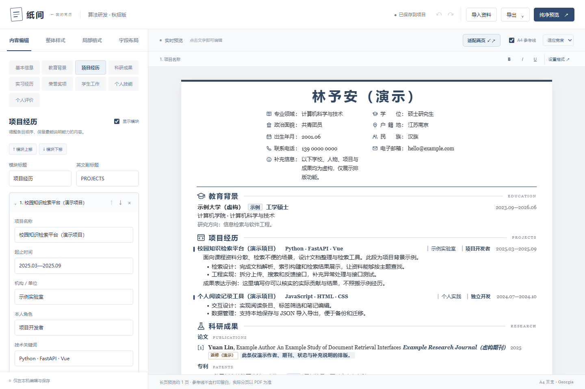
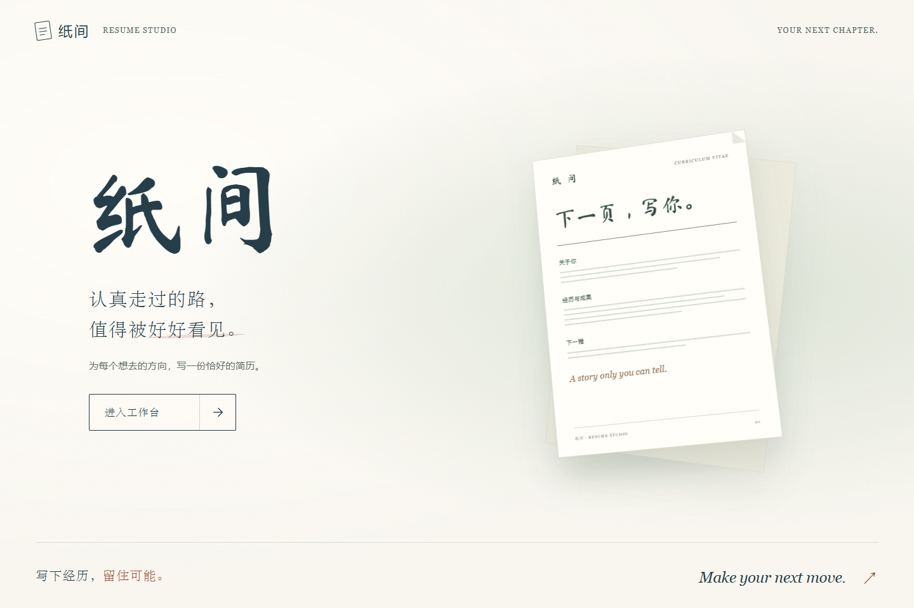
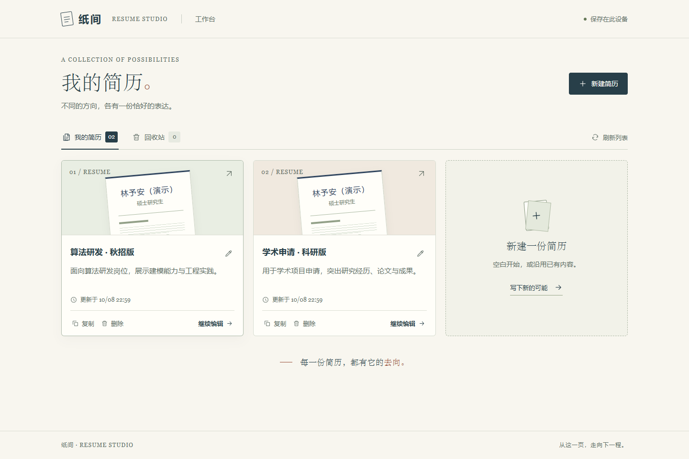

<h1 align="center">
  
  纸间 Zhijian
</h1>

<strong>认真走过的路，值得被好好看见。</strong>

本地运行的中文简历工作台，让内容、排版和每一次投递，都有自己的版本。

  
  
  

  <a href="#preview">功能预览</a> ·
  <a href="#quick-start">快速开始</a> ·
  <a href="#first-resume">写第一份简历</a> ·
  <a href="#faq">常见问题</a> ·
  <a href="https://github.com/MarkSSH/zhijian-resume/issues">反馈问题</a> ·
  <a href="README.en.md">English</a>

## 先看看纸间

左侧整理内容，右侧直接预览和编辑；既能调整整份简历，也能精细到一句话里的几个字。

展开查看：封面与多简历工作台

**从纸间封面出发**

**为不同方向，保留不同版本**

*截图均来自内置虚构演示数据。界面随版本更新可能略有变化；点击主图可查看大图。*

## 你可以用纸间做什么

| 你想做的事 | 纸间提供的方式 |
| --- | --- |
| 给不同岗位准备不同简历 | 新建、复制和命名独立版本，用一句用途说明区分投递方向。 |
| 让排版贴合自己的内容 | 表单与纸面编辑、字段排序和接续、局部文字样式，以及段落／分点／编号内容块。 |
| 导出一份能直接投递的简历 | 可选择文字的 A4 PDF；按实际分页尝试适配两页，保留 JSON 与离线 HTML 导出。 |
| 让修改有保存，也有退路 | 本机自动保存、浏览器暂存、撤销／重做、恢复上一版，以及可恢复的回收站。 |

适合中文学生、科研与技术项目简历，包含教育、项目、论文、专利、实习、奖项等模块；模块可排序、重命名和隐藏，英文优先使用 Georgia。使用不需要登录、订阅或 AI 服务。

### 为什么做纸间

一份经历，常常需要不止一种表达：科研申请看重研究脉络，岗位投递看重相关能力，而简历模板未必恰好容得下自己的内容。纸间围绕这些日常需求，把版本管理、文字编辑和排版放在同一个工作台里。

你负责写下真实的经历，纸间帮你把它整理成适合下一程的样子。它是编辑与排版工具，不会自动编造或改写你的履历。

## 安装与启动

**已经安装 Node.js 22+？** 下载并解压项目后，在包含 `package.json` 的文件夹里执行：

~~~sh
npm ci
npm run server
~~~

等待第一条命令成功完成后再执行第二条，随后打开 <http://127.0.0.1:4173/>。PDF 导出与两页适配还需要本机安装 Chrome 或 Edge。

**第一次接触命令行？** 展开下面的安装教程，再按后面的详细步骤操作。

首次准备：安装 Node.js、确认版本与准备浏览器

纸间通过本机的 Node.js 程序启动，再用浏览器打开。**Node.js** 负责运行程序，随安装包提供的 **npm** 负责安装项目依赖。无需编程基础，也不用安装代码编辑器。已经安装 Node.js 的用户可以直接验证版本，符合要求后继续下方启动步骤。

### 1. 安装 Node.js

本项目需要 **Node.js 22 或更新版本**，推荐 **Node.js 24 LTS**。LTS 表示长期支持版本；下载时选择带有 **LTS** 标记的版本即可，无需追求最新的 Current 版本。[官方下载页面](https://nodejs.org/en/download)

**Windows（推荐零基础用户使用安装包）：**

1. 打开上面的官方下载页面，选择 Windows 和 Node.js 24 LTS，下载 **Windows Installer（`.msi`）**。通常 Intel / AMD 电脑选择 x64；ARM 电脑选择 ARM64，不确定时可在“设置 → 系统 → 系统信息”的“系统类型”中查看。
2. 双击安装包，接受许可并按提示安装。保留默认的 npm 和 **Add to PATH** 选项，安装目录也可保持默认。
3. 如果出现额外安装原生模块编译工具的选项，本项目不需要勾选。完成安装后，关闭旧的命令行窗口，再打开新窗口。

**macOS：** 在同一官方下载页面选择 macOS，下载 LTS 的 **`.pkg` 安装包**，双击并按提示完成安装，然后重新打开“终端”。

**Linux：** 在官方下载页面选择 Linux 和 LTS，按页面给出的安装方式执行；不同发行版的步骤可能不同。也可参照 [npm 官方安装指南](https://docs.npmjs.com/downloading-and-installing-node-js-and-npm/)，安装后继续下面的版本检查。

### 2. 确认安装成功

Windows 按 `Win + R`，输入 `cmd` 后回车，打开“命令提示符”；macOS / Linux 打开“终端”。以下命令都在这个窗口中输入，**每行输入后按一次回车**，不要输入到浏览器地址栏。

~~~sh
node -v
npm -v
~~~

两条命令分别显示版本号（例如 `v24.x.x` 和 `11.x.x`，实际会是具体数字），就说明安装成功。`node -v` 的主版本号应至少为 22；npm 的版本号与 Node.js 不需要相同。若提示“不是内部或外部命令”或 `command not found`，先关闭并重新打开命令行，再检查安装是否完成。

### 3. 准备浏览器

PDF 导出和“适配两页”需要本机安装 **Chrome 或 Edge**。Windows 如果已有 Edge，就不必额外安装 Chrome。浏览器不需要一直开着，导出时程序会自动调用它。未安装时仍可启动编辑器，但不能使用上述两个功能。

### 1. 下载并打开项目文件夹

在[项目仓库](https://github.com/MarkSSH/zhijian-resume)点击 **Code → Download ZIP**，下载后先完整解压。打开解压后的文件夹，确认能看到 `package.json`、`package-lock.json` 和 `README.md`；这个文件夹就是后续命令需要使用的“项目根目录”。使用 ZIP 方式不需要安装 Git。

- **Windows：** 在上述文件夹的资源管理器地址栏中输入 `cmd`，按回车，即可在正确位置打开命令提示符。
- **macOS / Linux：** 打开终端，输入 `cd `（末尾有一个空格），再将项目文件夹拖入终端或输入其完整路径，按回车进入。例如 `cd "/Users/你的用户名/Downloads/zhijian-resume-main"`；请换成自己的实际路径。

不要在压缩包内运行，也不要直接双击 `home.html` 或 `index.html`；保存和导出功能需要下面的本地服务。

### 2. 安装依赖并启动

第一次使用时，在项目根目录运行：

~~~sh
npm ci
~~~

这一步需要联网，会按项目锁定的版本下载依赖。等待命令执行结束、命令行重新出现可输入的位置后，再运行：

~~~sh
npm run server
~~~

看到类似下面的提示，就表示服务启动成功：

~~~text
纸间 Zhijian · Resume Studio: http://127.0.0.1:4173
~~~

### 3. 打开工作台

在浏览器地址栏输入 <http://127.0.0.1:4173/>，点击“进入工作台”，然后新建简历。首次启动自动建立本地数据目录，不要求准备任何个人简历文件。

**使用期间请保留命令行窗口。** 服务启动后一直等待、没有返回输入提示符，是正常现象。用完后，在该窗口按 `Ctrl + C` 停止服务；Windows 若询问是否终止，输入 `Y` 后回车。下次使用时，进入同一项目文件夹执行 `npm run server` 即可；更新项目版本后建议重新执行 `npm ci`。

可选：更换启动端口与其他启动方式

默认端口被其他程序占用时，可改用：

~~~sh
npm run server 8080
# 也支持显式参数：npm run server -- --port 8080
~~~

此时访问 <http://127.0.0.1:8080/>。直接填写端口是项目提供的简写；使用 `--port` 时，前面的独立 `--` 用于告诉 npm 将后续参数传给程序，改用 `npm run` 也需要这个分隔符。

端口优先级为命令行参数、`PORT` 环境变量、默认 `4173`；有效范围为 1–65535。使用 `npm run server -- --help` 查看帮助。更换端口后仍读取同一数据目录；尚未保存的浏览器草稿按端口隔离，切换前请等待保存完成。避免同时启动多个服务写入同一数据目录；需要并行运行时分别指定 `ZHIJIAN_DATA_DIR`。

### 选择初始模板

新建窗口的“从哪里开始”提供：

- **空白简历**：使用固定的公开默认版式，所有个人内容为空。
- **演示简历 · 虚构内容**：展示项目内容块、论文、专利和字段排版。人物、学校、经历与成果均为虚构。
- **复制已有简历**：完整复制已有正文、图片、格式与布局，之后独立编辑。

内置预设位于 `presets/`。它们与用户数据分开；编辑或删除简历不会修改预设。已有本地版本会继续读取原数据，不会被演示内容覆盖。

`npm run server` 为推荐入口，原有的 `npm start` 和 `npm run preview` 仍可使用。关闭终端会停止服务，修改服务端代码后需重启。

## 写第一份简历

1. **先用示例熟悉一下。** 在工作台点“新建简历”，选择“演示简历 · 虚构内容”；正式填写时也可以从空白简历开始。
2. **替换成自己的经历。** 在“内容编辑”中填写基本信息和经历，按需要显示或隐藏模块。项目、实习正文可自由组合段落和分点。
3. **让重点更清楚。** 用“整体样式”调整全局，用“局部格式”强调关键词，用“字段布局”安排哪些信息同行、哪些靠右。
4. **确认保存与分页。** 等待顶部显示“已保存到项目”。内容较多时可尝试“适配两页”，再通过“查看分页”检查实际 PDF。
5. **导出并留一份备份。** 投递使用 PDF；同时导出 JSON，方便日后继续修改或迁移到另一台电脑。

| 导出格式 | 适合什么时候用 |
| --- | --- |
| **PDF** | 投递与打印，A4 分页，文字可选择。 |
| **JSON** | 备份与迁移，保留内容、图片和编辑格式，可重新导入纸间。 |
| **HTML** | 离线查看与分享网页文件，包含图片；继续在纸间编辑请保留 JSON。 |

进一步调整：局部格式、实习 Logo 与两页适配

左侧编辑内容与样式，右侧预览也可直接修改文字。修改停顿约 0.75 秒后自动保存。每份简历的局部样式、字段布局和正文块均保存到它自己的 JSON 中。

“字段布局”支持拖动或按钮排序、文字接续与左右对齐；“局部格式”支持整字段和部分选中文字。项目正文可按需插入段落块、分点块，列表每行是一点。教育背景、实习、项目、科研成果、奖项、技能、学生工作与评价可独立显示或隐藏。

空白模板与旧版升级中的“实习经历”默认位于教育背景之后、项目经历之前；演示模板有自己的模块顺序。实习条目可填写公司／机构、部门、实习岗位、起止时间，并使用段落、圆点或编号内容块。默认标题行采用“公司／机构　部门 · 岗位”的顺序，时间靠右。每条实习可上传、替换或移除单位 logo，显示在公司名称前；图片随 JSON、HTML、PDF 导出。它支持局部格式、字段布局、模块排序与导出。旧简历升级时先隐藏空实习模块；添加第一条实习会自动显示，也可以手动控制模块开关。

编辑器右上角可导出 PDF、JSON 和 HTML；JSON 与 HTML 会嵌入图片，可用于迁移或备份。“恢复上一版”使用上一次成功保存前的数据，整份简历恢复请使用工作台回收站。

“适配两页”优先调整间距和页边留白，必要时调整字号，再用真实 PDF 验证。正文通常不小于 11 px；原本更小的字号保持原值。无法在合理范围内达到两页时保留原样，不裁切内容。已是两页时，会尝试适度分配第一页剩余空间。操作可以撤销。

预览里的橙色虚线仅估算长度；导出或适配后出现的绿色标记来自实际 PDF 起页位置。超长条目跨页、字体替换或局部格式较复杂时，请通过“查看分页”核对结果。

## 常见问题

**下次使用还要重新安装吗？**

不用。进入同一项目文件夹，运行 `npm run server`，再打开启动提示中的网址即可。命令行窗口需要保持运行。

**内容会上传到云端吗？离线能不能用？**

编辑、保存与 PDF 生成都在本机完成，应用没有云端账户或同步服务。首次安装依赖需要联网；完成安装并准备好 Chrome／Edge 后，本机编辑与导出可离线使用。

**“适配两页”一定能变成两页吗？**

不保证。它在合理范围内调整间距、留白和字号，再用实际 PDF 检查；内容过多或过少时会保留原样，不裁切内容。操作可撤销，投递前请核对导出文件。

**换电脑怎么继续编辑？**

单份简历可导出 JSON，在新电脑新建简历后导入。迁移全部简历及回收站时，停止服务并复制完整数据目录；旧版本引用的照片和校徽也要保留。详见[数据与隐私](#data)。

**更新项目会不会丢失简历？**

用户数据与公开模板分开，更新代码不会用示例覆盖简历。更新前先停止服务并备份数据；如果重新下载 ZIP 到另一个目录，需要迁移数据或导入 JSON。更新后重新运行 `npm ci`，再启动。

**误删或者改错了怎么办？**

刚改的内容可以撤销；“恢复上一版”读取最近一次成功保存前的数据；整份简历误删后可在回收站恢复。彻底删除无法在应用内撤销。

启动或导出报错？展开排查表

| 遇到的情况 | 处理方法 |
| --- | --- |
| 找不到 `node` 或 `npm` | 安装后重新打开命令行；仍无效时重新运行 Node.js 安装程序，确认 npm 和 PATH 选项已安装。 |
| PowerShell 提示无法加载 `npm.ps1`，因为禁止运行脚本 | 使用上文的命令提示符（`cmd`），或在 PowerShell 中改用 `npm.cmd ci`、`npm.cmd run server`；不必修改系统执行策略。 |
| 提示找不到 `package.json`，或 `ENOENT` | 当前文件夹不对。回到解压后的项目根目录，确认能看到 `package.json` 和 `package-lock.json`，再打开命令行。 |
| `npm ci` 提示网络超时或连接失败 | 检查网络连接，恢复后重试；依赖未安装成功前不要继续启动。 |
| 提示端口 `4173` 已被占用 | 运行 `npm run server 8080`，并在浏览器打开 `http://127.0.0.1:8080/`。 |
| 浏览器无法打开页面 | 确认命令行仍在运行且没有报错，并核对浏览器中的端口与启动提示一致；关闭命令行后需要重新启动服务。 |
| PDF 导出提示找不到浏览器 | 安装 Chrome 或 Edge；若已安装在自定义位置，按[配置](#配置)设置 `RESUME_BROWSER_PATH`，然后重启服务。 |

## 数据与隐私

同一工作目录可以用于开发和个人使用。Git 只管理代码、文档、公开资源与虚构预设；默认 `data/`、历史材料和生成文件被忽略。

| 位置 | 用途 |
| --- | --- |
| `presets/blank.json`、`presets/demo.json` | 公开内置预设，纳入版本控制 |
| `data/library.json` | 当前简历与回收站目录，必须保留 |
| `data/resumes/<id>/resume.json` | 每份新简历的内容、样式与布局 |
| `resume.previous.json` | 最近一次保存前的数据，用于“恢复上一版” |
| `resume.original.json`、`resume.pre-v*.json` | 创建／升级时的历史快照，不作为启动模板 |
| `data/deleted/<id>/` | 回收站内容与历史备份 |
| `data/resume.json`、根目录 `index.html` | 兼容旧版 main 简历的数据和生成页面 |
| `data/blank-template.json` | 旧版遗留文件，当前不再读取或生成 |

生成的 `index.html` 可重新生成，请通过编辑器修改正文。完整迁移应备份整个数据目录；单份简历可通过 JSON 导出／导入。若旧资料仍引用 `assets/photo.jpg` 或 `assets/logo.svg`，也需保留这些本地文件；导出的 JSON 会将其嵌入。

原始照片、校徽、个人文档、测试截图及导出文件不属于公共示例。新增私人资源时，也要将其放到忽略的目录或补充忽略规则。不要把工作目录直接打包为公开下载；发布前应检查 Git 实际跟踪的文件和历史。

默认服务只监听本机回环地址，没有多用户认证与隔离；它适合本地使用。PDF 在本机独立的无界面浏览器中生成，不上传简历。公开在线演示需另行实现隔离，不能直接暴露个人数据目录。

回收站如何恢复和清理

在卡片底部选择“删除”，确认后进入回收站。工作台的“回收站”页可查看名称、用途与删除时间。

- **恢复**：保持原简历标识、内容、版式与已有历史备份，回到“我的简历”。
- **彻底删除**：再次确认后删除所选简历的回收站目录及历史备份，无法在应用内撤销。

没有自动清空或到期删除。独立导出的文件和共享图片不随回收站清理。已经在其他窗口更新的记录会要求刷新后重新操作；恢复后，旧编辑窗口需载入最新版本才能保存。

原版和最后一份简历都可以移入回收站；空工作台仍可从内置模板新建。之前版本保存在 `data/deleted/` 且由目录记录引用的删除备份，会自动显示在回收站。

## 配置

| 环境变量 | 默认值 | 用途 |
| --- | --- | --- |
| `PORT` | `4173` | 本地服务端口 |
| `ZHIJIAN_DATA_DIR` | 项目下的 `data/` | 用户数据目录；相对路径按项目根目录解析 |
| `RESUME_BROWSER_PATH` | 自动查找 | Chrome／Edge 可执行文件路径 |

PowerShell 示例：

~~~powershell
$env:ZHIJIAN_DATA_DIR = 'D:/MyResumes'
npm run server
~~~

macOS / Linux 示例：

~~~sh
ZHIJIAN_DATA_DIR="$HOME/.local/share/zhijian" npm run server
~~~

设置新的数据目录不会自动搬迁现有资料；使用前将完整数据目录复制到目标位置，或从空工作台导入 JSON。旧 main 数据不会因切换目录而被自动读取。

## 开发与贡献

这是一个基于原生 HTML、CSS 和浏览器 ES modules 的项目，服务端使用 Node.js HTTP 服务，PDF 由本机浏览器生成。无需先学习某个前端框架，就可以从一个样式或文案改进开始。

~~~sh
npm test
~~~

测试覆盖导入校验、转义、格式与布局、版本升级、保存冲突、首次空目录启动、回收站恢复／彻底删除、操作中断恢复、自定义数据目录和实际 PDF。PDF 测试需要上述浏览器环境。

主要实测环境为 Windows + Chrome。macOS / Linux 的路径探测已实现，但字体与浏览器版本会影响实际换行，尚不能保证跨系统输出完全一致。字体使用系统回退，未打包 Georgia 或中文系统字体。

项目结构与维护截图

| 文件／目录 | 职责 |
| --- | --- |
| `assets/brand/`、`assets/readme/` | 公开 Logo 与虚构数据产品截图 |
| `home.html`、`app/home.*`、`app/cover.css` | 封面、工作台、回收站与新建弹窗 |
| `editor.html`、`app/editor.*`、`app/advanced.js` | 内容、样式、字段布局和编辑交互 |
| `app/model.js`、`app/format.js` | 数据校验、版本升级、稳定标识与局部格式 |
| `app/render.js`、`app/icons.js`、`styles.css` | 共享简历渲染与排版 |
| `scripts/preview.mjs`、`scripts/cli.mjs` | 本地 HTTP 路由与启动参数 |
| `scripts/store.mjs` | 初始化、保存、备份、回收站和并发版本检查 |
| `scripts/presets.mjs`、`presets/` | 内置默认版式与虚构演示 |
| `scripts/pdf.mjs`、`scripts/pagination.mjs`、`app/pagination.js` | PDF 导出与实际分页适配 |
| `test/` | 自动化测试，使用独立临时数据 |

README 图片位于 `assets/readme/`，Logo 位于 `assets/brand/`。需要更新截图时运行：

~~~sh
node scripts/capture-readme.mjs
~~~

脚本使用独立临时数据目录和内置虚构示例，生成封面、工作台、编辑器三张截图；需要本机 Chrome 或 Edge。它不会读取你的个人简历，截图完成后清理自己的临时数据。

### 一起把纸间做得更好

- **遇到问题：** 先查找[已有 Issues](https://github.com/MarkSSH/zhijian-resume/issues)，找不到相同情况时[提交问题](https://github.com/MarkSSH/zhijian-resume/issues/new)。请写明操作步骤、预期与实际表现，以及操作系统、浏览器和 Node.js 版本。
- **有新的想法：** 在 Issue 中描述使用场景和遇到的困难，不需要先想好技术方案。
- **想动手改进：** 文案、翻译、示例与代码都欢迎，开始前请阅读[贡献指南](CONTRIBUTING.md)。

涉及排版时，附一张去除个人信息的截图或最小虚构 JSON 示例，会更容易定位问题。请不要在公开 Issue 中上传真实联系方式、照片或未公开的研究资料。

如果纸间帮到了你，欢迎点一颗 Star，让更多正在整理经历的人发现它。

## 许可与致谢

代码采用 [MIT License](LICENSE)。字体及依赖保留各自许可，详情见 [THIRD_PARTY_NOTICES.md](THIRD_PARTY_NOTICES.md)。HTML/CSS 简历方案参考了 VibeResume，相关 MIT 声明保留在 `licenses/`。

个人履历和私人素材不随本项目代码许可对外授权。
